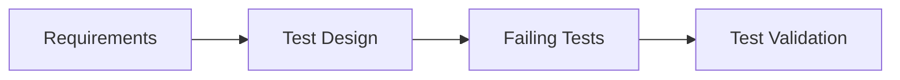
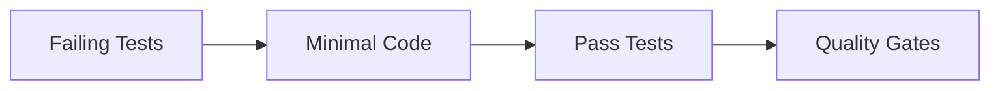
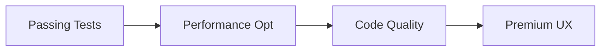
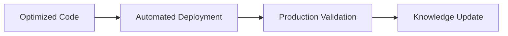
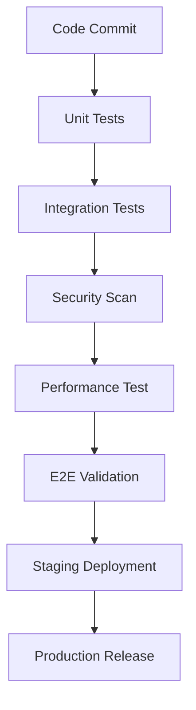
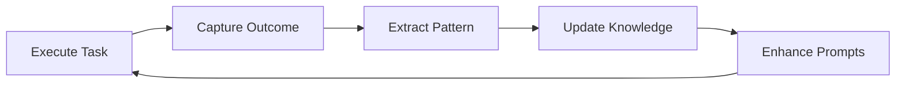

# 🧪 AMRIT DEVELOPMENT METHODOLOGY
*Test-Driven, AI-Native, Premium Quality Development Process*

## 🎯 **METHODOLOGY OVERVIEW**

The Amrit methodology combines **Test-Driven Development (TDD)**, **AI-native orchestration**, and **premium quality standards** to deliver robust, high-performance solutions with minimal human intervention.

### **Core Methodology Pillars:**

1. **🧪 Test-First Development**: Every feature begins with tests
2. **🤖 AI Orchestration**: Sophisticated prompt-driven automation
3. **⚡ Incremental Delivery**: Small, frequent, valuable releases
4. **📈 Performance Focus**: Optimization built into every phase
5. **✨ Premium Experience**: Professional-grade user interfaces and functionality
6. **🔄 Continuous Learning**: Knowledge accumulation across projects

---

## 🔄 **TDD-ENHANCED DEVELOPMENT CYCLE**

### **Phase 1: Test-First Planning (RED)**


**AI Tasks:**
1. **Analyze Requirements**: Break down business needs into testable units
2. **Design Test Cases**: Create comprehensive test scenarios
3. **Write Failing Tests**: Implement tests that capture desired behavior
4. **Validate Test Quality**: Ensure tests are meaningful and complete

**Acceptance Criteria:**
- [ ] All requirements covered by specific, testable scenarios
- [ ] Tests fail for expected reasons (feature not implemented)
- [ ] Test structure supports future refactoring
- [ ] Performance and security tests included

### **Phase 2: Minimal Implementation (GREEN)**


**AI Tasks:**
1. **Implement Features**: Write minimal code to pass tests
2. **Ensure Test Passage**: All tests must pass consistently
3. **Basic Integration**: Connect components at basic level
4. **Quality Validation**: Run automated quality checks

**Acceptance Criteria:**
- [ ] All tests pass consistently
- [ ] Code meets basic quality standards
- [ ] No security vulnerabilities introduced
- [ ] Performance within acceptable baseline

### **Phase 3: Premium Optimization (REFACTOR)**


**AI Tasks:**
1. **Performance Optimization**: Enhance speed and efficiency
2. **Code Quality**: Improve readability and maintainability
3. **Premium Experience**: Polish user interface and interactions
4. **Documentation**: Update docs and knowledge base

**Acceptance Criteria:**
- [ ] Performance meets premium standards (< 2s load times)
- [ ] Code quality scores 90%+ in automated tools
- [ ] UI/UX provides professional, polished experience
- [ ] Documentation updated with new learnings

### **Phase 4: Delivery & Learning (DEPLOY)**


**AI Tasks:**
1. **Automated Deployment**: Push to production with zero downtime
2. **Production Validation**: Verify functionality in live environment
3. **Performance Monitoring**: Establish metrics and alerting
4. **Knowledge Extraction**: Update framework with learnings

**Acceptance Criteria:**
- [ ] Deployment completes without issues
- [ ] Production metrics meet performance targets
- [ ] Monitoring and alerting operational
- [ ] Framework knowledge base updated

---

## 🏗️ **TECHNOLOGY STACK DECISION FRAMEWORK**

### **Stack Selection Criteria Matrix:**

| Criterion | Weight | Evaluation Method |
|-----------|--------|-------------------|
| **AI Friendliness** | 25% | Code complexity, documentation quality, predictable patterns |
| **Performance** | 20% | Benchmarks, real-world metrics, scalability tests |
| **Maintenance** | 20% | Community support, update frequency, breaking changes |
| **Cost Efficiency** | 15% | Infrastructure costs, development time, operational overhead |
| **Premium Capability** | 10% | UI/UX features, professional appearance, user experience |
| **Future-Proofing** | 10% | Technology adoption trends, ecosystem stability |

### **Recommended Technology Tiers:**

#### **🥇 Tier 1: High-Performance Full Stack**
```yaml
# Premium Performance & Features
Frontend: Vue.js 3 + Nuxt.js + Tailwind CSS
Backend: Node.js 18+ + Fastify/Express
Database: PostgreSQL 15 + Redis 7
Infrastructure: Docker + Kubernetes + Nginx
Testing: Jest + Playwright + k6
```

#### **🥈 Tier 2: Balanced Performance & Cost**
```yaml
# Optimal Balance
Frontend: Vue.js 3 + Tailwind CSS
Backend: Node.js 18+ + Express
Database: MySQL 8.0 + Redis 7
Infrastructure: Docker + Docker Compose + Nginx
Testing: Jest + Cypress + Artillery
```

#### **🥉 Tier 3: Cost-Optimized Rapid Development**
```yaml
# Maximum Efficiency
Frontend: Vue.js 3 + Bootstrap/Bulma
Backend: Node.js 18+ + Express
Database: SQLite + Redis
Infrastructure: Docker + Docker Compose
Testing: Jest + Puppeteer
```

---

## 🚀 **INCREMENTAL DELIVERY STRATEGY**

### **Feature Slicing Principles:**
1. **Vertical Slices**: Complete user value in minimal viable form
2. **Testable Units**: Each slice fully testable independently
3. **Production Ready**: Every slice deployable to production
4. **Progressive Enhancement**: Build complexity incrementally

### **Release Cadence:**
- **Daily**: Internal builds and testing
- **Weekly**: Feature releases to staging
- **Bi-weekly**: Production deployments
- **Monthly**: Major feature milestones

### **Quality Gates Per Release:**


---

## 📊 **QUALITY ASSURANCE FRAMEWORK**

### **Automated Quality Pyramid:**
```
                    🔺 Manual QA (5%)
                  🔺🔺 E2E Tests (10%)
                🔺🔺🔺 Integration Tests (25%)
              🔺��🔺🔺 Unit Tests (60%)
```

### **Quality Metrics & Targets:**

| Metric | Target | Validation Method |
|--------|--------|-------------------|
| **Test Coverage** | 90%+ | Automated coverage reporting |
| **Performance** | < 2s load time | Lighthouse CI, k6 testing |
| **Security** | Zero critical issues | OWASP ZAP, Snyk scanning |
| **Accessibility** | WCAG 2.1 AA | axe-core automated testing |
| **Code Quality** | A grade | SonarQube, ESLint scoring |
| **Documentation** | 100% API coverage | Automated doc generation |

### **Premium Experience Standards:**
- **Visual Design**: Professional, modern, consistent branding
- **Interaction Design**: Intuitive, responsive, accessible
- **Performance**: Fast loading, smooth animations, optimized assets
- **Reliability**: 99.9% uptime, graceful error handling
- **Security**: Zero tolerance for vulnerabilities

---

## 🧠 **AI ORCHESTRATION PATTERNS**

### **Prompt Orchestration Levels:**

#### **L1: Task-Level Prompts**
- Single, specific development tasks
- Clear acceptance criteria and validation
- Self-contained with minimal dependencies

#### **L2: Feature-Level Prompts**
- Complete feature implementation
- Multi-step task coordination
- Integration testing and validation

#### **L3: Phase-Level Prompts**
- Major project phases (foundation, development, deployment)
- Cross-feature coordination
- Quality assurance and optimization

#### **L4: Project-Level Prompts**
- Complete project orchestration
- Technology stack decisions
- Architecture and design patterns

### **AI Learning Integration:**


---

## 🔄 **CONTINUOUS IMPROVEMENT PROCESS**

### **Framework Evolution Cycle:**

#### **1. Project Execution**
- Apply current framework to real project
- Document all decisions and outcomes
- Track performance and quality metrics

#### **2. Learning Extraction**
- Identify successful patterns and approaches
- Analyze failures and improvement opportunities
- Quantify impact of different strategies

#### **3. Pattern Codification**
- Convert learnings into reusable prompts
- Update technology recommendations
- Enhance quality validation processes

#### **4. Framework Validation**
- Test improvements on subsequent projects
- Measure framework effectiveness metrics
- Validate cross-project applicability

### **Knowledge Accumulation Strategy:**
- **Pattern Library**: Reusable solution patterns
- **Decision Trees**: Technology selection guidance
- **Troubleshooting Guides**: Common issues and resolutions
- **Best Practices**: Industry standards and optimizations

---

## 🎯 **SUCCESS MEASUREMENT**

### **Development Velocity:**
- **Time to First Deploy**: Hours from project start to working deployment
- **Feature Delivery Rate**: Features shipped per week/month
- **Bug Resolution Time**: Time from detection to fix deployment
- **Knowledge Application**: Reuse rate of framework patterns

### **Quality Achievement:**
- **Defect Density**: Bugs per thousand lines of code
- **Performance Consistency**: Percentage of features meeting performance targets
- **Security Compliance**: Clean security audit results
- **User Satisfaction**: NPS scores and usage analytics

### **Cost Effectiveness:**
- **Development Cost**: Cost per feature point delivered
- **Infrastructure Efficiency**: Resource utilization and optimization
- **Maintenance Overhead**: Time spent on non-feature work
- **ROI Achievement**: Business value delivered per investment

---

**🎯 METHODOLOGY GOAL**: Establish a repeatable, AI-native development process that consistently delivers premium-quality software solutions while continuously learning and improving from each project experience.

*Methodology Version: 1.0*  
*Last Updated: August 24, 2025*  
*Next Review: After biz-dir-wiki project completion*
