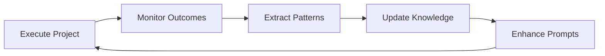

# 🧠 INTELLIGENT BUSINESS REQUIREMENT PARSER
*Amrit Framework - Advanced AI Capability*

## 🎯 **CAPABILITY OVERVIEW**
Transform plain-text business requirements into comprehensive development specifications using advanced AI analysis and pattern recognition.

## 📋 **INPUT FORMAT**
**Simple Command**: `develop my project using business requirement given in requirement-doc.txt and amrit framework`

**Expected File Structure**:
```
project-root/
├── requirement-doc.txt          # Plain text business requirements
├── .amrit-config.yml            # Optional: Organization-specific configurations
└── [project will be created here]
```

## 🔍 **REQUIREMENT PARSING PROCESS**

### **Phase 1: Content Analysis**
```yaml
Objective: Extract structured information from plain text
Process:
  1. Read and tokenize requirement document
  2. Identify business domain and industry context
  3. Extract functional and non-functional requirements
  4. Classify user personas and stakeholder needs
  5. Identify technology preferences and constraints
  6. Estimate complexity and resource requirements

Output:
  - Structured requirement specification
  - Business domain classification
  - Feature priority matrix
  - Technical constraint analysis
```

### **Phase 2: Organization Adaptation**
```yaml
Objective: Adapt to organization-specific patterns and standards
Process:
  1. Scan for existing organizational coding standards
  2. Identify deployment patterns and infrastructure preferences
  3. Detect architectural styles and technology stacks used
  4. Learn naming conventions and documentation styles
  5. Understand testing and quality practices
  6. Adapt to team structure and workflow preferences

Output:
  - Organization-specific adaptation profile
  - Coding standards detection report
  - Technology preference mapping
  - Workflow integration guidelines
```

### **Phase 3: Intelligent Project Design**
```yaml
Objective: Design optimal project architecture based on requirements and org patterns
Process:
  1. Apply Amrit technology selection matrix
  2. Integrate organization-specific preferences
  3. Design architecture based on complexity analysis
  4. Select optimal technology stack configuration
  5. Plan development phases and milestones
  6. Generate comprehensive project specification

Output:
  - Complete project architecture design
  - Technology stack specification
  - Development phase planning
  - Resource and timeline estimates
```

## 📝 **PLAIN TEXT REQUIREMENT PARSING PATTERNS**

### **Business Domain Detection**
```yaml
E-commerce Indicators:
  - "online store", "shopping cart", "payment processing"
  - "inventory management", "product catalog"
  - "customer orders", "order fulfillment"

Documentation System Indicators:
  - "knowledge base", "documentation", "wiki"
  - "content management", "article publishing"
  - "search functionality", "access control"

Analytics Platform Indicators:
  - "data visualization", "reporting", "dashboards"
  - "metrics tracking", "KPI monitoring"
  - "data analysis", "business intelligence"

Project Management Indicators:
  - "task tracking", "project planning", "team collaboration"
  - "milestone management", "resource allocation"
  - "progress reporting", "workflow automation"
```

### **Functional Requirement Extraction**
```yaml
User Management:
  - "users can register/login/logout"
  - "role-based access control"
  - "user profiles and preferences"

Data Management:
  - "create, read, update, delete" operations
  - "data import/export capabilities"
  - "backup and recovery features"

Integration Requirements:
  - "API integration", "third-party services"
  - "external system connectivity"
  - "data synchronization"

Performance Requirements:
  - "fast loading", "high performance"
  - "scalability", "concurrent users"
  - "uptime requirements"
```

### **Non-Functional Requirement Detection**
```yaml
Security Requirements:
  - "secure", "authentication", "authorization"
  - "data privacy", "compliance" (GDPR, HIPAA, etc.)
  - "encryption", "audit trails"

Performance Requirements:
  - "fast", "responsive", "real-time"
  - "load capacity", "concurrent users"
  - "availability", "uptime"

Usability Requirements:
  - "user-friendly", "intuitive", "easy to use"
  - "mobile responsive", "accessibility"
  - "professional appearance"

Maintainability Requirements:
  - "easy to maintain", "modular", "extensible"
  - "documentation", "testing"
  - "deployment automation"
```

## 🏢 **ORGANIZATION-SPECIFIC ADAPTATION**

### **Coding Standards Detection**
```yaml
Language Preferences:
  - Scan existing repositories for primary languages
  - Detect framework preferences (React vs Vue, Express vs Fastify)
  - Identify architectural patterns (MVC, microservices, monolith)

Code Style Analysis:
  - ESLint/Prettier configurations
  - Naming conventions (camelCase, snake_case, kebab-case)
  - File organization patterns
  - Comment and documentation styles

Quality Standards:
  - Testing frameworks and coverage requirements
  - CI/CD pipeline configurations
  - Code review processes
  - Security scanning tools
```

### **Infrastructure Patterns**
```yaml
Deployment Preferences:
  - Container usage (Docker, Kubernetes)
  - Cloud platform preferences (AWS, Azure, GCP)
  - Database choices (MySQL, PostgreSQL, MongoDB)
  - Caching strategies (Redis, Memcached)

Development Environment:
  - IDE and editor preferences
  - Development workflow tools
  - Version control practices
  - Collaboration tools integration
```

### **Team Workflow Adaptation**
```yaml
Communication Patterns:
  - Documentation standards and formats
  - Meeting and review processes
  - Progress reporting methods
  - Issue tracking systems

Development Practices:
  - Agile/Scrum/Kanban preferences
  - Sprint planning and execution
  - Testing and QA processes
  - Release and deployment schedules
```

## 🔒 **KNOWLEDGE ISOLATION ARCHITECTURE**

### **Organization-Local Knowledge** (Private)
```yaml
Location: isolators/org-local/{organization-id}/
Contents:
  - Coding standards and style guides
  - Architectural patterns and preferences
  - Technology stack configurations
  - Team workflow and processes
  - Business domain expertise
  - Internal tools and integrations

Security:
  - Encrypted local storage
  - Organization-specific access keys
  - No external sharing capability
  - Local-only knowledge application
```

### **Generic Framework Knowledge** (Shared)
```yaml
Location: isolators/shared-generic/
Contents:
  - General development best practices
  - Technology performance benchmarks
  - Security compliance patterns
  - UI/UX design principles
  - Testing methodologies
  - Deployment optimization techniques

Sharing:
  - Anonymized pattern extraction
  - No organization-specific details
  - No intellectual property sharing
  - Generic improvement contributions
```

## 🎯 **USAGE EXAMPLE**

### **Input: requirement-doc.txt**
```
Business Requirement: E-commerce Platform

We need an online store for selling handmade crafts. 
Customers should be able to browse products, add items to cart, and checkout securely.
We need inventory management for tracking stock levels.
The site should be mobile-friendly and load quickly.
We want to integrate with PayPal and Stripe for payments.
Admin panel needed for managing products and orders.
Should support multiple product categories and search functionality.
```

### **Amrit Framework Processing**
```bash
# Single command execution
develop my project using business requirement given in requirement-doc.txt and amrit framework
```

### **Automated Output**
```yaml
Project Analysis:
  Domain: E-commerce Platform
  Complexity: Medium
  Estimated Timeline: 6-8 weeks
  
Technology Stack Selected:
  Frontend: Vue.js 3 + Tailwind CSS (Organization preference detected)
  Backend: Node.js + Express (Based on org coding standards)
  Database: MySQL 8.0 (Infrastructure pattern match)
  Payments: Stripe SDK + PayPal Integration
  
Architecture:
  Pattern: MVC with API-first design
  Testing: Jest + Cypress (90% coverage target)
  Deployment: Docker + CI/CD pipeline
  
Organization Adaptations:
  - Applied detected TypeScript preferences
  - Using organization's ESLint configuration
  - Following detected naming conventions
  - Integrated with existing CI/CD tools
```

## 🔄 **SELF-IMPROVEMENT MECHANISM**

### **Learning Loop**


### **Improvement Categories**
```yaml
Technical Improvements:
  - Technology stack optimization based on performance results
  - Architecture pattern refinement from project outcomes
  - Testing strategy enhancement from bug detection patterns
  - Deployment process optimization from reliability metrics

Process Improvements:
  - Requirement parsing accuracy from project success rates
  - Estimation accuracy from actual vs predicted timelines
  - Quality gate effectiveness from defect prevention
  - User satisfaction correlation with design choices

Knowledge Enhancement:
  - Pattern recognition improvement from multiple projects
  - Domain expertise accumulation for specific industries
  - Technology trend integration from ecosystem changes
  - Best practice evolution from industry standards updates
```

## ✅ **EXECUTION WORKFLOW**

### **Step 1: Requirement Analysis**
1. Parse `requirement-doc.txt` using NLP techniques
2. Extract structured business requirements
3. Classify business domain and complexity
4. Identify stakeholders and user personas

### **Step 2: Organization Adaptation**
1. Scan existing codebase for patterns
2. Detect coding standards and preferences
3. Identify technology stack usage
4. Learn team workflow and processes

### **Step 3: Project Generation**
1. Apply Amrit framework methodology
2. Select optimal technology stack
3. Generate project structure and configuration
4. Create comprehensive development plan

### **Step 4: Autonomous Development**
1. Execute development phases using AI orchestration
2. Apply TDD methodology with continuous testing
3. Monitor progress and quality metrics
4. Adapt and optimize based on real-time feedback

### **Step 5: Knowledge Update**
1. Extract successful patterns and approaches
2. Update organization-local knowledge base
3. Contribute generic improvements to shared knowledge
4. Enhance framework capabilities for future projects

---

**🧠 INTELLIGENCE LEVEL**: Advanced - Natural language requirement processing  
**🔒 PRIVACY**: Organization knowledge isolated and secure  
**🔄 EVOLUTION**: Continuous self-improvement from project outcomes  
**⚡ EFFICIENCY**: Single command from requirements to running application  

*Intelligence Module Version: 1.0*  
*Last Updated: August 24, 2025*  
*Learning Capability: Active and evolving*
