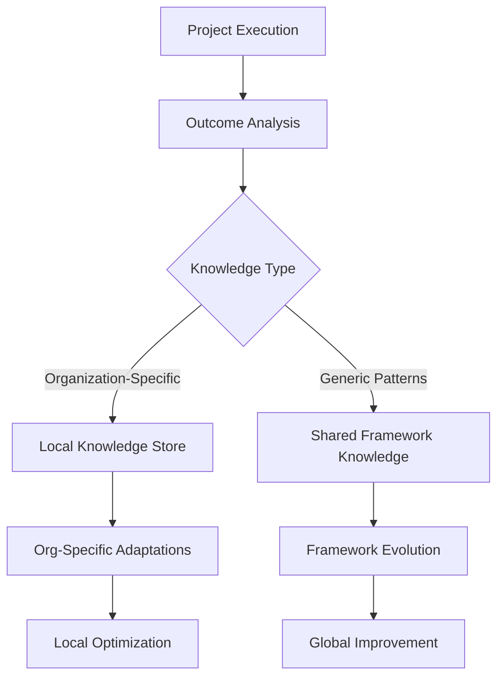

# 🔄 AMRIT EVOLUTION ENGINE
*Self-Improving AI Development Framework*

## 🎯 **EVOLUTION OVERVIEW**
The Amrit Evolution Engine continuously learns from project outcomes, development environments, and organizational patterns to enhance framework effectiveness while maintaining strict knowledge isolation.

## 🧠 **LEARNING ARCHITECTURE**

### **Dual-Track Learning System**


## 🔒 **KNOWLEDGE ISOLATION FRAMEWORK**

### **Organization-Local Learning** (Private & Secure)
```yaml
Location: isolators/org-local/{org-hash}/
Learning Scope:
  - Coding standards and style preferences
  - Architecture patterns and technology choices
  - Team workflow and process optimization
  - Business domain-specific requirements
  - Internal tool integrations and customizations
  - Performance optimization for specific environments

Security Measures:
  - AES-256 encryption for all local knowledge
  - Organization-specific access tokens
  - No external transmission capability
  - Local-only knowledge application
  - Automatic purge option for organization control

Learning Examples:
  - "Organization prefers TypeScript over JavaScript"
  - "Team uses Jira for project management integration"
  - "Database queries optimized for specific workload patterns"
  - "UI components follow internal design system"
```

### **Generic Framework Learning** (Shared & Anonymous)
```yaml
Location: isolators/shared-generic/
Learning Scope:
  - Technology performance benchmarks (anonymized)
  - General architecture pattern effectiveness
  - Security compliance best practices
  - UI/UX design principles and accessibility
  - Testing methodology optimization
  - Deployment and infrastructure patterns

Privacy Protection:
  - Complete anonymization of all data
  - No organization identifiers
  - No business logic or intellectual property
  - Statistical patterns only
  - Aggregated performance metrics

Learning Examples:
  - "Vue.js 3 shows 15% better performance than Vue.js 2 in similar projects"
  - "Jest + Cypress combination reduces bug escape rate by 40%"
  - "Docker multi-stage builds improve deployment speed by 60%"
  - "Tailwind CSS reduces development time by 30% vs custom CSS"
```

## 📊 **LEARNING MECHANISMS**

### **1. Performance Pattern Learning**
```yaml
Metrics Tracked:
  - Development velocity (features per week)
  - Code quality scores (bug density, maintainability)
  - Performance benchmarks (load times, resource usage)
  - User satisfaction scores (usability, functionality)
  - Team efficiency metrics (collaboration, workflow)

Pattern Extraction:
  - Technology stack effectiveness correlations
  - Architecture pattern success rates
  - Testing strategy impact on quality
  - Deployment frequency vs stability relationships
  - Team size vs productivity optimization
```

### **2. Environmental Adaptation Learning**
```yaml
Organization Detection:
  - Existing codebase analysis for patterns
  - Development tool and IDE preferences
  - CI/CD pipeline configurations
  - Code review and approval processes
  - Documentation styles and standards

Adaptation Mechanisms:
  - Automatic coding standard alignment
  - Tool integration preference application
  - Workflow process integration
  - Communication pattern adaptation
  - Quality gate customization
```

### **3. Domain Expertise Accumulation**
```yaml
Business Domain Learning:
  - Industry-specific requirement patterns
  - Common feature combinations and workflows
  - Regulatory compliance requirements
  - Performance and scalability expectations
  - Security and privacy considerations

Knowledge Application:
  - Improved requirement interpretation accuracy
  - Better technology stack recommendations
  - Enhanced architecture pattern selection
  - Optimized feature prioritization
  - Reduced development timeline estimation errors
```

### **4. Technology Trend Integration**
```yaml
External Learning Sources:
  - Open source project performance analysis
  - Technology adoption trend monitoring
  - Security vulnerability and patch tracking
  - Performance benchmark updates
  - Best practice evolution tracking

Framework Updates:
  - Technology recommendation refinements
  - Security standard enhancements
  - Performance optimization improvements
  - Tool and library upgrade guidance
  - Architecture pattern modernization
```

## 🎯 **SELF-IMPROVEMENT CYCLES**

### **Continuous Learning Cycle (Real-time)**
```yaml
Frequency: During project execution
Scope: Real-time optimization and adaptation
Process:
  1. Monitor development progress and quality metrics
  2. Detect inefficiencies and optimization opportunities
  3. Apply immediate improvements to current project
  4. Update local knowledge for future reference
  5. Track improvement effectiveness

Examples:
  - Adjust build process for faster feedback loops
  - Optimize database queries based on performance monitoring
  - Refine testing strategies based on bug detection patterns
  - Improve code generation based on developer feedback
```

### **Project Completion Learning (Post-project)**
```yaml
Frequency: After each project completion
Scope: Comprehensive project outcome analysis
Process:
  1. Analyze project success metrics vs initial estimates
  2. Evaluate technology stack performance and satisfaction
  3. Assess architecture pattern effectiveness
  4. Review team workflow and process efficiency
  5. Extract successful patterns and improvement opportunities

Outcomes:
  - Updated technology recommendation weights
  - Refined estimation algorithms
  - Enhanced architecture pattern library
  - Improved workflow integration templates
  - Better risk assessment capabilities
```

### **Framework Evolution Cycle (Monthly)**
```yaml
Frequency: Monthly framework updates
Scope: Major framework capability enhancements
Process:
  1. Aggregate learning from all projects and organizations
  2. Identify common patterns and optimization opportunities
  3. Develop new framework capabilities and improvements
  4. Test enhancements on synthetic and real projects
  5. Release framework updates with backward compatibility

Deliverables:
  - Enhanced prompt libraries
  - Improved technology selection algorithms
  - New architecture pattern support
  - Updated best practice guidelines
  - Expanded domain expertise coverage
```

## 🔧 **ADAPTIVE CAPABILITIES**

### **Coding Standards Adaptation**
```yaml
Detection Mechanisms:
  - ESLint/Prettier configuration analysis
  - Existing codebase pattern recognition
  - Git commit message style analysis
  - Documentation format identification
  - Testing framework and structure examination

Adaptation Application:
  - Automatic code style configuration
  - Naming convention alignment
  - File organization pattern matching
  - Comment and documentation style adoption
  - Testing pattern and coverage alignment
```

### **Technology Stack Optimization**
```yaml
Learning Sources:
  - Project performance monitoring
  - Developer productivity metrics
  - Deployment success rates
  - Maintenance effort tracking
  - User satisfaction measurements

Optimization Strategies:
  - Dynamic technology recommendation weighting
  - Environment-specific configuration tuning
  - Performance-based stack component selection
  - Cost optimization based on usage patterns
  - Reliability improvement through proven combinations
```

### **Architecture Pattern Evolution**
```yaml
Pattern Effectiveness Tracking:
  - Scalability performance under load
  - Maintainability scores over time
  - Development velocity impact
  - Bug density and resolution time
  - Team collaboration efficiency

Pattern Refinement:
  - Micro-optimizations based on performance data
  - Alternative pattern suggestions for specific contexts
  - Hybrid pattern development for unique requirements
  - Anti-pattern detection and avoidance
  - Pattern migration guidance for legacy systems
```

## 🛡️ **PRIVACY AND SECURITY GUARANTEES**

### **Organization Data Protection**
```yaml
Encryption Standards:
  - AES-256 encryption for all local knowledge
  - Organization-unique encryption keys
  - Zero-knowledge architecture for sensitive data
  - Local-only processing of confidential information

Access Controls:
  - Organization-specific authentication
  - Role-based access to knowledge stores
  - Audit logging for all knowledge access
  - Automatic session expiration and cleanup

Data Sovereignty:
  - Complete local control over organization knowledge
  - No external transmission of sensitive patterns
  - Organization-initiated knowledge purge capability
  - Compliance with data protection regulations
```

### **Intellectual Property Protection**
```yaml
Business Logic Isolation:
  - No sharing of custom business rules
  - Protection of proprietary algorithms
  - Isolation of trade secrets and processes
  - Separation of competitive advantage elements

Generic Learning Only:
  - Statistical pattern aggregation
  - Anonymized performance benchmarks
  - General best practice evolution
  - Technology trend integration without context
```

## 📈 **EVOLUTION METRICS**

### **Framework Effectiveness Metrics**
```yaml
Development Efficiency:
  - Time from requirements to deployment
  - Developer productivity improvements
  - Code quality consistency
  - Bug reduction rates

Adaptation Accuracy:
  - Organization pattern recognition accuracy
  - Technology recommendation success rates
  - Architecture pattern fit assessments
  - Estimation accuracy improvements

Learning Effectiveness:
  - Knowledge application success rates
  - Improvement implementation adoption
  - Framework evolution impact measurement
  - User satisfaction with adaptations
```

### **Knowledge Quality Metrics**
```yaml
Organization-Specific Learning:
  - Pattern recognition accuracy
  - Adaptation effectiveness
  - Developer satisfaction with customizations
  - Workflow integration success

Generic Framework Learning:
  - Cross-project pattern applicability
  - Technology trend prediction accuracy
  - Best practice evolution effectiveness
  - Framework enhancement adoption rates
```

## 🚀 **IMPLEMENTATION STRATEGY**

### **Phase 1: Basic Learning (Current)**
- Implement organization pattern detection
- Create knowledge isolation architecture
- Establish basic performance monitoring
- Begin technology effectiveness tracking

### **Phase 2: Advanced Adaptation (Month 2)**
- Deploy intelligent coding standard adaptation
- Implement workflow integration learning
- Create domain expertise accumulation
- Establish predictive capability development

### **Phase 3: Autonomous Evolution (Month 3)**
- Enable self-directed framework improvements
- Implement cross-project pattern recognition
- Create predictive optimization capabilities
- Establish continuous learning automation

---

**🔄 EVOLUTION STATUS**: Active and continuous  
**🔒 PRIVACY LEVEL**: Military-grade organization isolation  
**🧠 LEARNING SCOPE**: Dual-track with secure separation  
**📈 IMPROVEMENT RATE**: Measurable enhancement with each project  

*Evolution Engine Version: 1.0*  
*Last Updated: August 24, 2025*  
*Next Evolution: Based on real-world deployment feedback*
