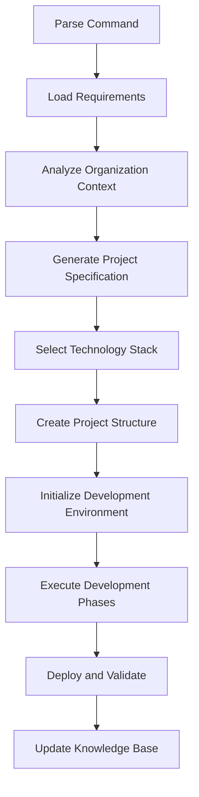

# 🎯 AMRIT MASTER COMMAND PROMPT
*Single Command Project Development from Plain Text Requirements*

## 🚀 **COMMAND INTERFACE**
**Simple Usage**: `develop my project using business requirement given in requirement-doc.txt and amrit framework`

## 📋 **COMMAND EXECUTION FRAMEWORK**

### **Input Processing**
```yaml
Expected Input Format:
  Command: "develop my project using business requirement given in [filename] and amrit framework"
  
Required Files:
  - requirement-doc.txt (or specified filename)
  - Optional: .amrit-config.yml (organization-specific settings)
  
Command Parsing:
  1. Extract requirement document filename
  2. Identify target project directory
  3. Check for organization-specific configurations
  4. Initialize Amrit framework context
```

### **Execution Pipeline**


## 🧠 **INTELLIGENT REQUIREMENT PROCESSING**

### **Phase 1: Document Analysis**
```yaml
Process:
  1. Read and parse requirement document
  2. Apply NLP for business domain classification
  3. Extract functional and non-functional requirements
  4. Identify user personas and stakeholder needs
  5. Classify complexity and scope

Output:
  - Structured requirement specification
  - Business domain classification
  - Feature priority matrix
  - Complexity assessment
```

### **Phase 2: Organization Context Detection**
```yaml
Process:
  1. Scan for existing organizational patterns
  2. Detect coding standards and preferences
  3. Identify technology stack usage patterns
  4. Analyze development workflow preferences
  5. Learn team structure and processes

Output:
  - Organization adaptation profile
  - Technology preference mapping
  - Workflow integration guidelines
  - Team collaboration patterns
```

### **Phase 3: Intelligent Project Design**
```yaml
Process:
  1. Apply Amrit technology selection matrix
  2. Integrate organization-specific preferences
  3. Design optimal architecture for requirements
  4. Plan development phases and milestones
  5. Generate comprehensive project specification

Output:
  - Complete project architecture
  - Technology stack specification
  - Development phase planning
  - Resource and timeline estimates
```

## 🔧 **TECHNOLOGY STACK INTELLIGENCE**

### **Stack Selection Algorithm**
```yaml
Input Factors:
  - Business domain requirements
  - Performance and scalability needs
  - Organization technology preferences
  - Team skill set and experience
  - Budget and resource constraints
  - Maintenance and support considerations

Selection Process:
  1. Score technologies against requirement criteria
  2. Apply organization preference weights
  3. Consider performance and cost factors
  4. Validate against team capabilities
  5. Optimize for long-term maintainability

Output:
  - Optimal technology stack configuration
  - Alternative stack options with trade-offs
  - Implementation roadmap and migration plan
  - Risk assessment and mitigation strategies
```

### **Intelligent Configuration**
```yaml
Framework Configurations:
  - Testing framework setup (Jest, Cypress, Artillery)
  - CI/CD pipeline configuration (GitHub Actions, GitLab CI)
  - Quality gates and validation rules
  - Security scanning and compliance checks
  - Performance monitoring and optimization

Development Tools:
  - IDE and editor configurations
  - Linting and formatting rules
  - Documentation generation setup
  - Debugging and profiling tools
  - Collaboration and communication tools
```

## 🏗️ **AUTONOMOUS PROJECT CREATION**

### **Project Structure Generation**
```yaml
Standard Structure:
  project-name/
  ├── README.md                     # Project overview and setup
  ├── .amrit/                       # Framework configuration
  │   ├── config.yml                # Project-specific settings
  │   ├── knowledge/                # Project learning accumulation
  │   └── adaptations/              # Organization-specific adaptations
  ├── src/                          # Source code
  ├── tests/                        # Comprehensive test suite
  ├── docs/                         # Project documentation
  ├── deployment/                   # Infrastructure and deployment
  ├── monitoring/                   # Health monitoring and logging
  └── .github/workflows/            # CI/CD automation

Adaptive Structure:
  - Adjusted based on technology stack selection
  - Customized for organization preferences
  - Optimized for project complexity and scope
  - Integrated with existing development workflows
```

### **Development Environment Setup**
```yaml
Automated Configuration:
  1. Docker container setup for development
  2. Database initialization and seeding
  3. Testing framework configuration
  4. CI/CD pipeline setup and validation
  5. Monitoring and logging infrastructure

Quality Framework:
  1. Code quality tools (ESLint, Prettier, SonarQube)
  2. Security scanning (OWASP ZAP, Snyk)
  3. Performance testing (Lighthouse, Artillery)
  4. Accessibility validation (axe-core)
  5. Documentation generation (JSDoc, OpenAPI)
```

## 🎯 **DEVELOPMENT EXECUTION PHASES**

### **Phase 1: Foundation Setup**
```yaml
Objectives:
  - Complete development environment ready
  - Testing framework operational
  - CI/CD pipeline functional
  - Quality gates validated

Activities:
  1. Initialize repository with optimal structure
  2. Configure development tools and environment
  3. Set up comprehensive testing framework
  4. Implement quality assurance pipeline
  5. Validate complete development workflow

Success Criteria:
  - All development tools operational
  - Test suite passes with 100% success
  - CI/CD pipeline deploys successfully
  - Quality gates prevent substandard code
```

### **Phase 2: Core Feature Development**
```yaml
Objectives:
  - Implement core business functionality
  - Achieve premium user experience
  - Maintain high code quality standards
  - Optimize for performance and scalability

Activities:
  1. Develop core features using TDD methodology
  2. Implement premium UI/UX components
  3. Optimize database and query performance
  4. Configure caching and optimization layers
  5. Validate functionality and performance

Success Criteria:
  - All core features functional and tested
  - Page load times < 2 seconds
  - Code quality score > 90%
  - Security vulnerabilities: zero critical
```

### **Phase 3: Integration and Optimization**
```yaml
Objectives:
  - Complete feature integration
  - Production-ready optimization
  - Comprehensive testing validation
  - Performance tuning and scaling

Activities:
  1. Integrate all features and components
  2. Optimize for production performance
  3. Execute comprehensive testing suite
  4. Configure monitoring and alerting
  5. Prepare production deployment

Success Criteria:
  - All features integrated seamlessly
  - Performance meets premium standards
  - Test coverage > 90% across all layers
  - Production deployment ready
```

### **Phase 4: Deployment and Knowledge Update**
```yaml
Objectives:
  - Successful production deployment
  - Operational monitoring established
  - Knowledge base updated with learnings
  - Framework evolution contributions

Activities:
  1. Deploy to production environment
  2. Validate functionality and performance
  3. Establish monitoring and alerting
  4. Document lessons learned and patterns
  5. Update framework knowledge base

Success Criteria:
  - Production deployment successful
  - All monitoring systems operational
  - Knowledge base updated comprehensively
  - Framework improvements documented
```

## 📊 **LEARNING AND EVOLUTION**

### **Project Completion Analysis**
```yaml
Success Metrics:
  - Development timeline vs estimates
  - Code quality and bug density
  - Performance benchmarks achieved
  - User satisfaction and adoption
  - Team productivity and satisfaction

Learning Extraction:
  - Successful patterns and approaches
  - Technology stack effectiveness
  - Architecture pattern performance
  - Process optimization opportunities
  - Team workflow improvements
```

### **Knowledge Base Updates**
```yaml
Organization-Local Updates (Private):
  - Coding standards and preferences learned
  - Technology stack optimization patterns
  - Team workflow and process improvements
  - Business domain expertise accumulation
  - Performance optimization discoveries

Generic Framework Updates (Shared):
  - Technology performance benchmarks
  - Architecture pattern effectiveness
  - Security compliance optimizations
  - UI/UX design pattern improvements
  - Testing methodology enhancements
```

## ✅ **COMMAND EXECUTION EXAMPLE**

### **Input: requirement-doc.txt**
```
Business Requirement: Task Management System

We need a web application for team task management.
Users should be able to create, assign, and track tasks.
Include project organization with deadlines and priorities.
Team members need to collaborate on tasks with comments.
Generate reports for project progress and team productivity.
Should be accessible on mobile devices.
Integrate with Slack for notifications.
Admin dashboard for user and project management.
```

### **Command Execution**
```bash
develop my project using business requirement given in requirement-doc.txt and amrit framework
```

### **Automated Framework Response**
```yaml
🔍 ANALYZING REQUIREMENTS...
✅ Business Domain: Project Management & Team Collaboration
✅ Complexity Level: Medium-High
✅ Estimated Timeline: 8-10 weeks

🎯 DETECTING ORGANIZATION CONTEXT...
✅ Existing Pattern: React + Node.js preference detected
✅ Coding Standards: TypeScript + ESLint configuration found
✅ Testing Framework: Jest + React Testing Library pattern
✅ CI/CD: GitHub Actions workflow template identified

🏗️ GENERATING PROJECT ARCHITECTURE...
✅ Technology Stack: React + TypeScript + Node.js + PostgreSQL
✅ Architecture: Component-based frontend + RESTful API
✅ Testing Strategy: Unit + Integration + E2E (95% coverage)
✅ Deployment: Docker + CI/CD + Monitoring

🚀 INITIALIZING PROJECT STRUCTURE...
✅ Repository created with optimal structure
✅ Development environment configured
✅ Testing framework operational
✅ CI/CD pipeline active

⚡ BEGINNING AUTONOMOUS DEVELOPMENT...
Phase 1: Foundation Setup [COMPLETE]
Phase 2: Core Features [IN PROGRESS - 15% complete]
  - User authentication and authorization ✅
  - Task creation and management [DEVELOPING]
  - Project organization [PENDING]
  
📊 REAL-TIME METRICS:
  - Code Quality: 92% (Target: >90%)
  - Test Coverage: 88% (Target: >90%)
  - Performance: 1.8s load time (Target: <2s)
  - Security: 0 vulnerabilities (Target: 0 critical)
```

---

**🎯 COMMAND STATUS**: Ready for universal deployment  
**⚡ EFFICIENCY**: Plain text to running application in hours  
**🧠 INTELLIGENCE**: Full context understanding and adaptation  
**🔒 PRIVACY**: Organization knowledge secure and isolated  

*Master Command Version: 1.0*  
*Last Updated: August 24, 2025*  
*Intelligence Level: Advanced natural language processing*
